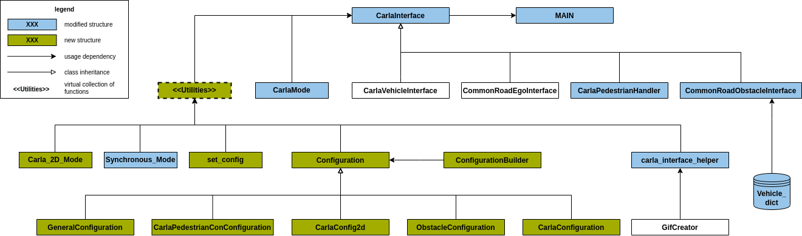

# CommonRoad-CARLA Interface
## Introduction
This repository contains only the current draft version of the interface itself. 
The code for converting a map from CommonRoad to OpenDRIVE is located in the CommonRoad Scenario Designer.

## Requirements
Interface for using CommonRoad together with CARLA
Entrypoint is CarlaInterface.py. Python packages required:
- pygame
- imageio 
- moviepy
- setuptools
- numpy
- carla
- typer
- commonroad-io
- lxml
- omegaconf

## Installation
To install requirement open terminal in CommonRoad-CARLA Interface and run:
```
pip install -e .
```
### Notes
- You may have to update the path to the local CARLA executable (carla_root_path in carla_config.yaml)
- CARLA simulator needs to be installed separately, see [here](https://carla.readthedocs.io/en/latest/start_quickstart/#a-debian-carla-installation)
- As of now (Aug 2022), CARLA 0.9.13 is not fully compatible with Ubuntu 22.04. Hence, Ubuntu 20.04 is recommended.
Be aware that you might encounter problem like "jammy release not found" while installing CARLA in Ubuntu 22.04.
- Virtual Ubuntu environment will probably cause problems due to GPU connecting issues. Hence, dual boot is recomended if you don't have a Linux OS yet.
- `libomp` library is needed by installation, which can be installed simply by 
    ```angular2html
        > sudo apt-get install libomp-dev
    ```


## Getting started
To simulate only a CommonRoad scenario in CARLA.

### 1 - Simple start

1. 3D Mode (Carla Default mode)

&nbsp; &nbsp; &nbsp; &nbsp; Set the parameters in `cr_simple_start.py` and run:
``` 
python tutorials/cr_simple_start.py
```
2. Off-screen mode

&nbsp; &nbsp; &nbsp; &nbsp; Set the parameters in `cr_simple_start_offscreen.py` and run:

``` 
python tutorials/cr_simple_start_offscreen.py
```
3. 2D mode can not with oneline code start.

&nbsp; &nbsp; &nbsp; &nbsp; Set the parameters in `cr_simple_start.py` and run:
```
python tutorials/cr_simple_start.py
```
&nbsp; &nbsp; &nbsp; &nbsp; Wait until your scenario is loaded, then run:
```
python carlacr/mode/start_2d_mode.py
```
### 2 - Start step by step

#### 3D mode (Carla default mode and off-screen mode)

1. Load configuration files and set sleep_time
```
config = set_configs()
sleep_time = config.config_carla.sleep_time
```
2. Run a CARLA server (Debian installation:)

&nbsp; &nbsp; &nbsp; &nbsp; A. 3D mode:

~~~
    with subprocess.Popen([config.config_carla.carla_path]):
        time.sleep(sleep_time)
~~~

&nbsp; &nbsp; &nbsp; &nbsp; B. Off-screen mode:

```
    with subprocess.Popen([config.config_carla.carla_path, '-RenderOffScreen']):
        time.sleep(sleep_time)
```

3. Create a CARLA client object<br/>

```
    client = carla.Client(config.carla_config.host, config.carla_config.port)
```
4. Define path of map and path of scenario 
```
    map_path = config.general.map_path
    scenario_path = config.general.scenario_path
```
5. Define name of map and name of scenario ("four_way_crossing" is an example)
```
    map_name = "four_way_crossing"
    scenario_name = "four_way_crossing_Modi"
```

6. Initialize _CarlaInterface_<br/>

~~~
    ci = CarlaInterface(open_drive_map_path, carla_client, cr_scenario_file_path)
~~~

7. Load the map in CARLA<br/>
   require all user write permission for directory: 
CarlaUE4/Content/Carla/Maps/OpenDrive/
```
    ci.load_map()
```
8. Setup CarlaInterface<br/>
```
    ci.setup_carla(hybrid_physics_mode)
```
9. Run the scenario<br/>
```
    ci.run_scenario(clean_up, carla_vehicles, carla_pedestrians)
```
## Aerial view mode (2D mode)


First run the code the same as 3D mode in `#1` Terminal.   

When the 3D mode started 
(Street from `.xodr` file showed in carla windows), 
run the `carlacr/mode/carla_2d_mode.py` in `#2` Terminal.   

#### Example for aerial view mode:

&nbsp; &nbsp; &nbsp; &nbsp; 1. Run `cr_sim_example.py` in `tutorials` in 
`#1` Terminal, and wait until your scenario is loaded 
(For example, "four_way_crossing"). 

```
    python cr_sim_example.py
```

&nbsp; &nbsp; &nbsp; &nbsp; 2. Run `carlacr/mode/carla_2d_mode.py`

```
    python carla_2d_mode.py
```

&nbsp; &nbsp; &nbsp; &nbsp; 3. You can run `cr_sim_example.py` in `tutorials` 
one more time to see the 2D view running in windows `CARLA No Rendering Mode Visualizer` from start.


## Traffic generation mode

Please see example_traffic_generation_mode.ipynb for details.


## Documentation
to generate the documentation from the source, first install the dependencies with pip:
```
pip install -r docs/doc_requirements.txt
```
Afterward run:
```
cd docs && make html
```
## Tests

For testing info please refer to folder `tests/`.

## Structure of Commonroad-CARLA interface
### UML diagram



### Tree structure of folders

```angular2html
.
├── carlacr
│   ├── command_line_interface.py
│   ├── configurations
│   │   ├── configuration_builder.py
│   │   ├── configuration.py
│   │   ├── defaults
│   │   │   ├── carla_2D_mode.yaml
│   │   │   ├── carla_config.yaml
│   │   │   ├── carla_pedestrians.yaml
│   │   │   ├── general.yaml
│   │   │   └── obstacle_interface.yaml
│   │   ├── __init__.py
│   │   ├── __pycache__
│   │   │   ├── configuration_builder.cpython-37.pyc
│   │   │   ├── configuration.cpython-37.pyc
│   │   │   ├── __init__.cpython-37.pyc
│   │   │   └── set_configs.cpython-37.pyc
│   │   └── set_configs.py
│   ├── helper
│   │   ├── carla_interface_helper.py
│   │   ├── __init__.py
│   │   ├── __pycache__
│   │   │   ├── carla_interface_helper.cpython-37.pyc
│   │   │   ├── __init__.cpython-37.pyc
│   │   │   └── vehicle_dict.cpython-37.pyc
│   │   └── vehicle_dict.py
│   ├── __init__.py
│   ├── interface
│   │   ├── carla_interface.py
│   │   ├── carla_pedestrian_handler.py
│   │   ├── carla_vehicle_interface.py
│   │   ├── commonroad_ego_interface.py
│   │   ├── commonroad_obstacle_interface.py
│   │   ├── __init__.py
│   │   └── __pycache__
│   │       ├── carla_interface.cpython-37.pyc
│   │       ├── carla_pedestrian_handler.cpython-37.pyc
│   │       ├── carla_vehicle_interface.cpython-37.pyc
│   │       ├── commonroad_ego_interface.cpython-37.pyc
│   │       ├── commonroad_obstacle_interface.cpython-37.pyc
│   │       └── __init__.cpython-37.pyc
│   ├── mode
│   │   ├── carla_2d_mode.py
│   │   ├── carla_mode.py
│   │   ├── __init__.py
│   │   ├── __pycache__
│   │   │   ├── carla_mode.cpython-37.pyc
│   │   │   ├── __init__.cpython-37.pyc
│   │   │   └── synchronous_mode.cpython-37.pyc
│   │   └── synchronous_mode.py
│   └── __pycache__
│       └── __init__.cpython-37.pyc
├── carlacr_main_function.py
├── ci
│   ├── Dockerfile
│   └── README.md
├── commonroad_carla_interface.egg-info
│   ├── dependency_links.txt
│   ├── PKG-INFO
│   ├── requires.txt
│   ├── SOURCES.txt
│   └── top_level.txt
├── docs
│   ├── Carlacr_OnlyClass.drawio
│   ├── Carlacr_OnlyClass_V8.png
│   ├── doc_requirements.txt
│   ├── Makefile
│   ├── README.md
│   ├── setup.sh
│   └── source
│       ├── api
│       │   ├── additional_modules.rst
│       │   ├── carla_interface.rst
│       │   ├── carla_mode.rst
│       │   ├── carla_pedestrian_handler.rst
│       │   ├── carla_vehicle_interface.rst
│       │   ├── commonroad_ego_interface.rst
│       │   ├── commonroad_obstacle_interface.rst
│       │   └── index.rst
│       ├── conf.py
│       ├── figures
│       │   └── DEU_Test-1_1_T-1.png
│       ├── img
│       │   └── commonroad_white150.png
│       ├── index.rst
│       └── user
│           ├── getting_started.rst
│           └── index.rst
├── example_videos
│   ├── carla_2D_mode_example.mp4
│   ├── carla_example.mp4
│   ├── carla_pedestrian_example.mp4
│   └── Traffic_generation_mode.mp4
├── __init__.py
├── MANIFEST.in
├── maps
│   ├── DEU_Test-1_1_T-1_no_center.xodr
│   ├── DEU_Test-1_1_T-1.xodr
│   └── four_way_crossing.xodr
├── README.md
├── requirements.txt
├── scenarios
│   ├── DEU_Test-1_1_T-1.xml
│   ├── four_way_crossing_Modi.xml
│   └── four_way_crossing.xml
├── setup.py
├── tests
│   ├── __init__.py
│   ├── README.md
│   ├── run_tests.py
│   ├── test_ci.py
│   └── video
├── tree-structure-carla-interface.txt
└── tutorials
    ├── cr_sim_example_offscreen.py
    ├── cr_sim_example.py
    ├── cr_simple_start_offscreen.py
    ├── cr_simple_start.py
    ├── example_traffic_generation_mode.ipynb
    └── video
        └── DEU_Test-1_1_T-1_12_12_2021_14_56_00
            └── ego.gif

27 directories, 95 files

```


