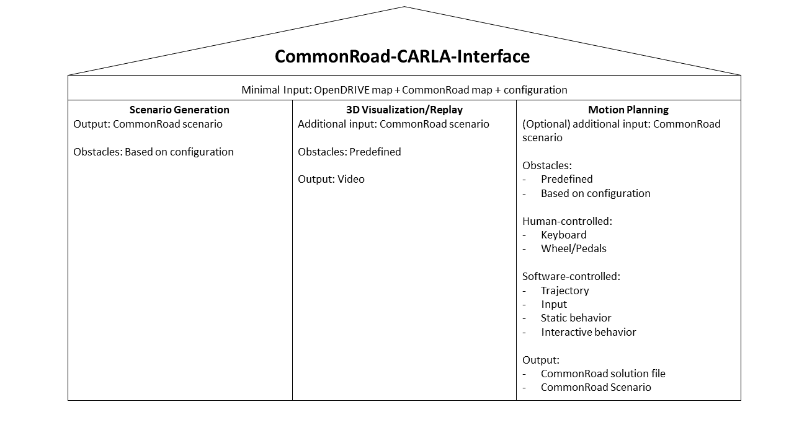

# CommonRoad-CARLA Interface
## Introduction
The CommonRoad-CARLA Interface provides APIs to use CommonRoad-based tools together with the 3D simulator CARLA 
(version 0.0.14).   
The code for converting a map from CommonRoad to OpenDRIVE is located in the CommonRoad Scenario Designer.



***
## Installation
### Carla
Install Carla 9.14 via [package installation](https://carla.readthedocs.io/en/latest/start_quickstart/#b-package-installation).
Also install the additional maps. 
- You can test it via running ./CarlaEU4.sh. If an error occurs, try **./CarlaEU4.sh -opengl -prefernvidia**

### Poetry Package Manager Installation
The usage of the [Poetry Package Manager](https://python-poetry.org/) is recommended. Poetry uses `.lock` files or `.toml` files to automatically generate an environment for the root folder project you are using it in. 
- Note that poetry uses your **system python3** by default, which might not be compatible with your project. You can also use other Python3 installations.
- PyCharm supports poetry environments


### Installing the CARLA-CR-Bridge
- **!WARNING!**: Poetry might get stuck on protected gitlab repos (e.g. commoroad-prediction and commonroad-reactive-planner), if you dont use ssh key validation.
1. Clone the [carla-cr-interface repo]
2. Install Python3.8 on your system
3. Create a new Poetry environment:
```bash
poetry env use /usr/bin/python3.8
poetry install --with tests,docs,tutorials -vvv
poetry shell
```

- Currently, the  `--with` arg might produce errors.

We recommend to use PyCharm (Professional) as IDE.  
The path to CARLA can either be provided manually via the config parameters or the CARLA release folder path corresponds 
to one of our default locations: /opt/carla-simulator/, /~/CARLA_0.9.14_RSS/, /~/CARLA_0.9.14/ (default paths work only 
for Ubuntu).


***
## Documentation
You can generate the documentation within your activated Poetry environment using.
```bash
poetry shell
cd docs/source && sphinx-build -b html . ../public
```
The documentation will be located under docs/public, where you can open `index.html` in your browser to view it.

***
## Getting started
For each supported interaction, there is a [tutorial script](tutorials/). Currently, the visualization in CARLA is not working properly, **only off-screen rendering** works stable. You can use these tutorial scripts as the starting point for this practical course.

#### Features:
We support five ways of interacting with CARLA:
- **CommonRoad scenario replay**: 2D/3D visualization of CommonRoad scenarios together with solutions.  
- **Keyboard control**: Controlling an ego vehicle via keyboard in a 2D/3D visualization.
- **Scenario Generation**: Generation of CommonRoad scenarios with different configurations.
- **Motion planning (wip)**: Driving in a CARLA simulation with a CommonRoad-based motion planner.
- **Wheel control (not yet implemented)**: Controlling an ego vehicle via steering wheel and pedals in a 2D/3D 
visualization.

We support CARLA's synchronous and asynchronous mode as well as its offscreen mode. **Currently, not using the offscreen mode is not stable.**  
For the offscreen mode, we support a 2D birds-eye visualization.  
The default configuration can be found under carlacr/helper/config.py.  
The CARLA interface can take care about starting the CARLA server.

If you are developing on a virtual machine and want to use ofscreen mode:
Paste: 
```
os.environ["SDL_VIDEODRIVER"] = "dummy"
```
into carla_interface.py.
This configures SDL to use the dummy NULL video driver so pygame can run without a windowing system.
